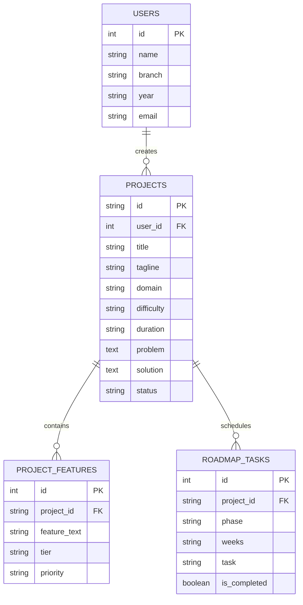

# 🎓 ProjectPilot AI — “From Idea to Implementation”
> **AI-Powered Project Idea Generator & Comprehensive Implementation Assistant for Final-Year Engineering Students**

---

## 🌟 The Core Problem & USP

Every final-year undergraduate faces the same paralyzing question:
> *“I don't know what project to make. Everything is either too hard, already copied from GitHub, or irrelevant to my career goals.”*

**ProjectPilot AI** bridges this gap by guiding students from:
> **“I don't know what project to make”** ➔ **“Here is my validated project, tech stack, feature breakdown, development roadmap, and academic documentation.”**

Instead of a generic chatbot that just lists titles, ProjectPilot handles the **complete project lifecycle**:

```
Student Profile 
      ↓
Personalized Ideas 
      ↓
Compare & Score Ideas 
      ↓
Select Project 
      ↓
Generate Features (MVP vs Advanced vs Future) 
      ↓
Choose Technology with Architectural Rationale 
      ↓
Interactive Development Roadmap (Week-by-Week) 
      ↓
AI Improvement Advisor (Security, Perf, UI, AI) 
      ↓
IEEE-Format Academic Documentation Generator 
      ↓
AI Project Mentor Chat (Viva & Debugging Guidance)
```

---

## 🚀 Key Features

### 1. Student Engineering Profile
- Academic branch selection (CSE, IT, AI/DS, ECE, EEE, ME, Civil).
- Current languages and known frameworks.
- Target domains (AI/ML, Healthcare, EdTech, Cybersecurity, IoT, FinTech, Web3).
- Difficulty calibration (Beginner, Intermediate, Advanced).
- Team size and development duration (1 to 10 months).

### 2. AI Project Idea Generator
- Synthesizes realistic, high-impact final-year projects.
- Produces problem statements, technical solutions, and target user definitions.
- Works in two modes:
  - **Live Google Gemini 2.5 Flash API**: Live multimodal LLM inference with structured JSON output.
  - **Smart Academic Heuristic Synthesizer**: Zero-configuration, high-fidelity offline engine that generates tailored blueprints instantly without requiring an API key.

### 3. Multi-Metric Project Recommendation Scoring
Evaluates each project across 6 practical dimensions:
| Metric | Description |
| :--- | :--- |
| **Skill Match %** | Alignment with the student's current languages and tools |
| **Innovation %** | Uniqueness and novelty of the proposed solution |
| **Difficulty Grade** | Calibrated against student year and experience |
| **Real-World Utility %**| Tangible problem solving impact for external users |
| **Resume Value %** | Attractiveness to recruiters during campus placements |
| **Completion Feasibility %** | Practical achievability within the allotted timeframe |

### 4. 3-Tier Feature Breakdown
- **Basic (MVP) Features**: Foundational auth, database operations, and baseline UI.
- **Advanced Features**: Differentiating AI capabilities, multimodal reasoning, and real-time streaming.
- **Future Scope (v2)**: Scalability enhancements ready for the project report's *Future Scope* chapter.

### 5. Technology Stack Recommendation & Architectural Rationale
- Recommends Frontend, Backend, Database, AI/ML, and Deployment platforms.
- Crucially answers **“Why was this chosen?”** so students can confidently defend their architecture during viva examinations.

### 6. Dynamic Development Roadmap & Interactive Task Tracker
- Dynamically scales phases (Planning, UI/UX, Backend APIs, AI Integration, Testing, Viva Prep) across the student's exact timeframe (e.g. 12 weeks, 16 weeks).
- Interactive checkboxes that automatically recalculate overall project progress.

### 7. AI Improvement Advisor
- Actionable suggestions across 6 critical dimensions: **Missing Features**, **Performance**, **Security**, **UI/UX**, **AI Enhancements**, and **Scalability**.

### 8. Academic Project Documentation Generator
- IEEE-compliant academic draft containing:
  - Title & Author Attribution
  - Abstract
  - Introduction & Motivation
  - Problem Statement & Objectives
  - Existing System Drawbacks vs. Proposed System Advantages
  - System Architecture & Technology Stack Description
  - Testing & Verification Plan
  - Future Scope & Conclusion
- 1-click **Export as Markdown (`.md`)** and **Print / Save as PDF**.

### 9. Project Dashboard & Progress Tracker
- Interactive dashboard reflecting live milestone completion, task counts, and quick actions.

### 10. AI Project Mentor Chat
- Instant assistance for viva questions, dataset sourcing, schema architecture, and edge-case handling.

---

## 🏗️ Technical Architecture & Repository Structure

```
projectpilot-ai/
├── index.html                 # Main Single Page Web Application UI
├── app.js                     # Core State, Gemini API Client & Local Synthesizer
├── styles.css                 # Glassmorphic Styling, Animations & Print CSS
├── package.json               # Frontend meta & scripts
├── README.md                  # Comprehensive documentation
├── sample_data/
│   └── sample_projects.json   # Seed benchmark final-year projects
└── backend/
    ├── main.py                # FastAPI REST Server & CORS Middleware
    ├── models.py              # Pydantic Schemas & SQLAlchemy ORM Models
    ├── engine.py              # Prompt Engineering & AI Pipelines
    ├── database.py            # SQLite / PostgreSQL Connection Manager
    └── requirements.txt       # Python Dependencies
```

---

## ⚡ How to Run ProjectPilot AI

### Option A: Instant Zero-Dependency Browser Run (Recommended)
ProjectPilot AI is engineered to run directly in any web browser without build tools or node_modules overhead:
1. Double-click or open `index.html` in Chrome, Firefox, Edge, or Safari:
   ```powershell
   Start-Process "C:\Users\User\.gemini\antigravity\scratch\projectpilot-ai\index.html"
   ```
2. Enter your profile details or explore the preloaded benchmark projects.
3. (Optional) Click the ⚙️ gear icon to enter your Google Gemini API key for live LLM responses.

### Option B: Run with Python FastAPI Backend
If you want to run the REST API and persist data into SQLite:
1. Install backend requirements:
   ```bash
   pip install -r backend/requirements.txt
   ```
2. Set your optional Gemini API key:
   ```bash
   export GEMINI_API_KEY="your-gemini-api-key"
   # On Windows PowerShell:
   $env:GEMINI_API_KEY="your-gemini-api-key"
   ```
3. Start the FastAPI development server:
   ```bash
   uvicorn backend.main:app --reload --port 8000
   ```
4. Access the interactive Swagger API documentation at:
   `http://localhost:8000/docs`

---

## 🗄️ Relational Database Schema



---

## 🎓 Tips for College Project Submission & Viva Defense

1. **Focus on Problem Validation**: Before writing code, explain *who* experiences the problem and *why* existing software fails.
2. **Understand Every Line of Tech**: Examiners will challenge choices like *"Why did you pick FastAPI over Flask?"* or *"Why PostgreSQL over MongoDB?"*. Refer to the **Tech Stack & Rationale** tab in ProjectPilot AI for ready answers.
3. **Have a Contingency Plan**: Keep a local screen recording of your working system in case campus internet fails during the viva presentation.
